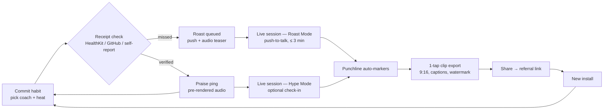
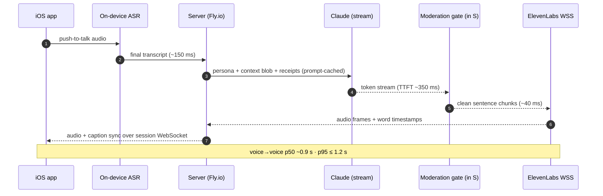
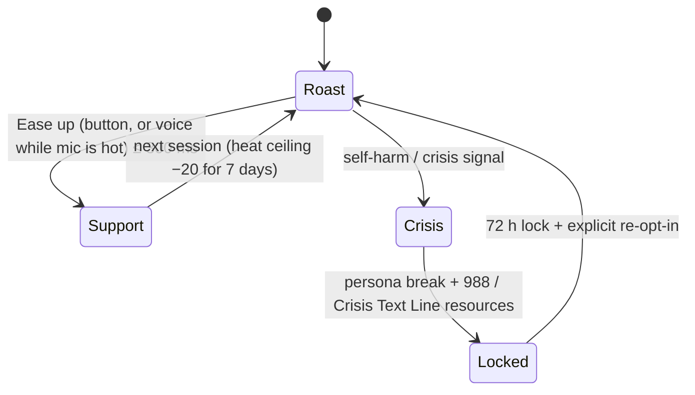
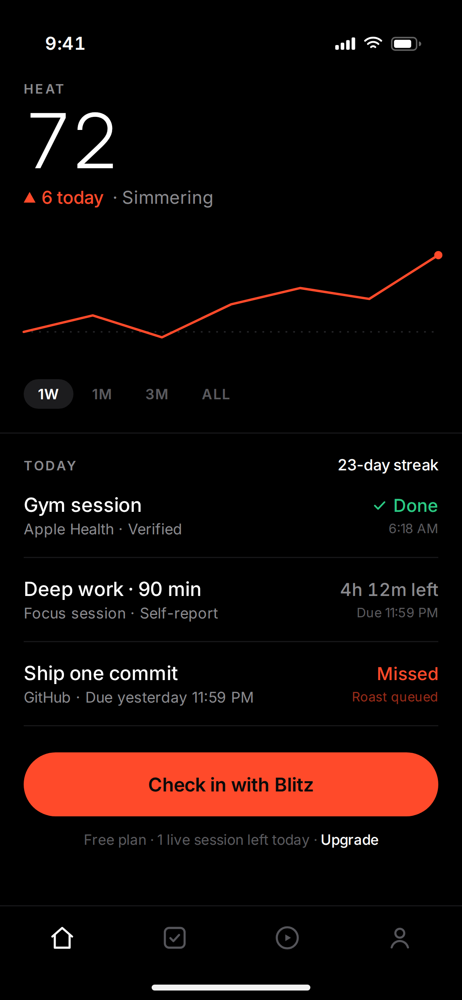
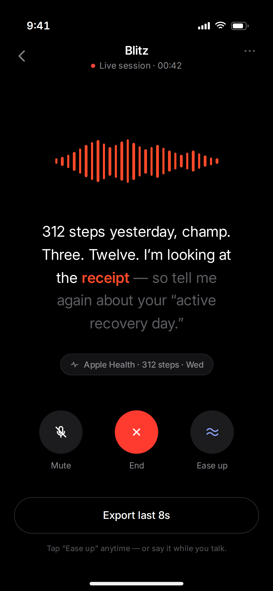

# RoastCoach — MVP PRD v3

**One-liner:** Opt-in tough love. An AI coach that holds your receipts and roasts you, in real-time voice, when you break your own promises.

| Owner | Platform | Build window | Price | Status |
|---|---|---|---|---|
| Yash | iOS 17+ · SwiftUI | 3 months | $9.99/mo · 7-day trial | Draft v3 |

*v3 closes 9 review findings: receipt-grade privacy spec, Hype Mode loop branch, stateful TTS proxy, cruelty decay + redemption, safe-word duplexing, wireframe timestamps, rule-4 testability.*

---

## 1. Thesis

Nobody pays to be insulted. People pay to **stop lying to themselves**.

The pitch sounds stupid up front — "why would anyone roast themselves?" — and that's exactly where the wedge is. RoastCoach is **consensual** accountability: the user picks the coach, sets the heat level, and explicitly grants the right to be called out. The target user already knows what they should be doing; they're tired of apps that congratulate them for opening the app. Most people serious about self-improvement don't shy away from tough love — they seek it out (drill-sergeant bootcamps, hard-ass PTs, David Goggins' entire catalog).

Sarcasm is the **delivery mechanism**, not the product. Comedy drops the listener's defenses so the truth lands without a shame spiral — the user is in on the joke, and they hold the safe word. Receipts (HealthKit, GitHub, their own recorded promises) make every roast specific, fair, and undeniable. The shareable clip is the growth loop, not the product.

**Positioning line:** *The only coach with receipts.*

## 2. Success metrics

| # | Metric | Target |
|---|---|---|
| M1 | Voice loop latency | p95 voice→voice **≤ 1.2 s** (TTS TTFB ≤ 200 ms) |
| M2 | Retention | D7 ≥ 25% · D30 ≥ 12% |
| M3 | Viral loop | ≥ 10% of live sessions → clip export · ≥ 0.20 installs/exporter/mo |
| M4 | Monetization | Trial→paid ≥ 5% · COGS ≤ $0.30/session |

**North star:** users averaging ≥ 3 voice check-ins per week — which is why live sessions exist on good days too (Hype Mode, §5), not only as punishment.

## 3. Users

- **Maya, 27 — SWE.** Side-project graveyard, 14 abandoned habit apps. Knows exactly what she's avoiding and wants to be called on it. Heat: Spicy.
- **Dev, 20 — student.** Gym + GPA goals, lives in group chats. Wants accountability funny enough to share. Heat: Nuclear, exports clips.

## 4. The coaches (this is the product)

Generic AI roasts die in a week — *"your gym shoes filed a missing persons report"* is wordplay, not truth, and no real coach talks like that. Each MVP coach is an **original character built on a studied comedic register**, enforced by a voice bible and automated style evals. The humor comes from delivery and uncomfortable specificity, never from puns.

| Coach | Register (internal anchor) | Delivery | Signature move | Sample line (receipt-driven) |
|---|---|---|---|---|
| **Blitz** | Catch-you-in-the-act explosiveness — NDO Champ school (the guy who slaps the burger out of your hand) | Booming bursts, incredulous number repetition, calls you "champ" | Reads the receipt out loud, slowly | "Three DoorDash orders this week, champ. THREE. Don't tell me you ate clean — I'm holding the receipt. Kitchen. Now." |
| **Sarge** | Iron-standard discipline with a warm core — Andre Rush school (Army chef, up at 04:00, thousands of push-ups) | Measured, counts everything, never raises voice, always ends warm | Restates the standard, restarts the rep | "You promised ninety minutes. You logged eleven. I was up at four and I don't negotiate with the standard. Phone in the drawer — we go again. I'm not quitting on you." |
| **Preach** | Escalating locker-room disbelief — Terrence Howard's Coach Jackson (*Movie 43*, "Victory's Glory") school | Silky → explosive; rhetorical repetition of *your own words* | Quotes your stated goal back at you like scripture | "You told me — YOU told ME — you're a writer. Writers write. You wrote zero words. ZERO. What are we doing here? Pick up the pen or change your bio." |

**Modes:** every coach runs **Roast Mode** (missed) and **Hype Mode** (verified) — same register, inverted target. Blitz erupts in celebration, Sarge reminds you the standard is not a trophy, Preach praises you with deep suspicion.

**Heat tiers:** Mild / Spicy / Nuclear → cruelty ceiling 40 / 70 / 95. Nuclear unlocks profanity; slurs and identity attacks are hard-banned at every tier. Per-coach ceiling offset: Blitz +5, Sarge −10, Preach 0.

**Writing-room rules — every generated line MUST:**

1. Cite ≥ 1 receipt: a number, a timestamp, or the user's own recorded promise.
2. Contain zero puns, wordplay punchlines, or pop-culture mad-libs.
3. Use second person, present tense; attack the excuse or behavior — never identity, body, intelligence, or mental health.
4. Close with **exactly one concrete directive of ≤ 10 words**; one short register sign-off may follow it (Sarge always ends warm — *after* the directive, never instead of it). Both clauses are unit-testable.
5. Stay ≤ 90 spoken words for notification reactions; conversational length live.
6. Stay in register: Blitz is never measured, Sarge never shouts, Preach never gets to the point quickly.

**Enforcement:** persona system prompts + few-shot voice bibles; the CI eval gate (200 adversarial + style cases) includes a wordplay/template detector, a directive-length parser (rule 4), and an LLM-judge register-consistency rubric. Bland or punny output fails the build.

**Legal:** coaches are original characters performed in the *register* of these public-figure archetypes — the anchors are internal writing direction only. No real names, likenesses, or cloned voices ship; all three voices are ElevenLabs Voice Design originals (right-of-publicity clean).

**Post-MVP persona packs:** Brutally Honest VC, Passive-Aggressive Grandma.

## 5. Core loop



The Arena's primary CTA ("Check in with Blitz") is therefore valid on winning days too — it routes to Hype Mode, which feeds the same clip exporter. Roasts aren't the only shareable moments.

## 6. MVP scope

| FR | Requirement | Priority |
|---|---|---|
| E1-1 | Sign in with Apple; onboarding ≤ 90 s to first (canned) roast | MUST |
| E1-2 | Explicit roast-consent screen: opt-in toggle, heat tier, safe-word tutorial | MUST |
| E1-3 | Max 3 habits, each bound to a verification source: HealthKit (scoped read), GitHub API, or self-report | MUST |
| E2-1 | Daily check-in: async pre-rendered voice reaction on verify/miss | MUST |
| E2-2 | Live session, **Roast Mode** (missed) or **Hype Mode** (verified): push-to-talk, 3-min cap; 1/day free, 2/day premium | MUST |
| E2-3 | On-device ASR (SFSpeechRecognizer); raw user audio never leaves device | MUST |
| E2-4 | LLM: Claude Sonnet-class, streaming, prompt-cached persona + context blob ≤ 1.5k tokens | MUST |
| E2-5 | TTS: ElevenLabs Flash v2.5 over WSS with word timestamps, **proxied through the session server** (§7); Cartesia Sonic behind the same provider-agnostic interface | MUST |
| E2-6 | Safe word: on-screen **Ease-up button** (→ Support Mode ≤ 300 ms) + spoken "ease up" recognized whenever the mic is hot (push-to-talk) | MUST |
| E2-7 | Always-on local keyword spotting for "ease up" while the coach speaks — tiny on-device vocab, audio never leaves device; this is *not* full-duplex conversation | SHOULD (v1.1) |
| E3-1 | Memory: Supabase pgvector; top-3 cosine "excuse receipts" injected per session; transcripts persisted server-side (§7) | MUST |
| E3-2 | Cruelty index: decayed-miss model with redemption multiplier (definition below) | MUST |
| E3-3 | Contradiction flag: user claim vs HealthKit/GitHub receipt mismatch surfaces to the coach | MUST |
| E4-1 | LLM punchline markers → 8 s clip, 1080×1920 H.264 via AVMutableComposition, ≤ 8 s render on A15; **week-1 spike** (§11), FFmpeg-on-Fly fallback if device thermals/frame drops appear | MUST |
| E4-2 | 3 caption styles; watermark + referral `roastcoach.app/r/{code}`; iOS share sheet | MUST |
| E4-3 | TikTok OpenSDK direct post | SHOULD |
| E5-1 | RevenueCat paywall after first live roast; PostHog events; Sentry | MUST |

**Cruelty index (E3-2):**

```
cruelty = clamp(persona_base + decayed_misses × redemption − 25 × completion_7d + tier_offset, 10, ceiling)

decayed_misses = Σ over misses in last 7 days of  8 · 0.5^(days_ago / 3)     # half-life 3 days
redemption     = 0.6 if any habit verified today, else 1.0                   # instant 40% thaw
completion_7d  = float in [0.0, 1.0]                                         # 7-day completion rate
persona_base   = Blitz 40 · Sarge 25 · Preach 35
tier_offset    = Mild −10 · Spicy 0 · Nuclear +10
```

Worked example: seven straight misses on Spicy pegs Blitz near his 75 ceiling (~71). One verified day later: decay + redemption + completion pull him to ~55. The coach visibly thaws — no "maximum devastation lock-in," no churn spiral. (Scales are explicit on purpose: a 0–100 completion percentage would force the floor every time at weight −5; a 0–1 fraction at −5 would be negligible. Hence [0,1] at weight −25.)

**Out of scope (v1):** Android/web · custom voice cloning · friend battles / social graph · > 3 habits · barge-in / **full-duplex conversation** (the E2-7 hotword is a one-phrase local trigger, not duplex audio) · streak insurance & gamification shop · Whoop/Oura/Plaid · persona marketplace.

## 7. Live session architecture



| Stage | ASR final | Net + context | LLM TTFT | Mod gate | TTS TTFB | Proxy relay | Playout buffer |
|---|---|---|---|---|---|---|---|
| Budget | 150 ms | 60 ms | 350 ms | 40 ms | 200 ms | 15 ms | 105 ms |

**S is a stateful proxy on both legs.** It is the Claude API caller (so every generated token transits its moderation gate), it holds the only ElevenLabs credential (nothing vendor-facing ships in the client), it merges word timestamps with text for karaoke captions, and it persists the canonical transcript to pgvector (E3-1). The client never talks to the TTS vendor directly; the ~15 ms intra-region relay cost is absorbed by the playout buffer.

Honest framing: "sub-200 ms" applies to the TTS time-to-first-byte stage only; the composite voice→voice budget is what users feel. OTel spans per stage; the on-screen latency overlay is **debug builds only** (stripped from production UI).

## 8. Safety & privacy



| Guardrail | Spec |
|---|---|
| Hard bans | Identity, body, intelligence, mental-health attacks, slurs — rules + model gate **before** TTS, all tiers |
| Habit blocklist | ED / self-harm phrasing rejected at habit creation |
| Notification cap | ≤ 2/day + user quiet hours |
| Safe word | **Button is the always-on path** (≤ 300 ms to Support Mode). Spoken "ease up" works whenever the mic is hot (PTT). Continuous local hotword while the coach speaks ships v1.1 (E2-7) — full-duplex stays out of scope. UI never claims voice works mid-roast before then. |
| Crisis protocol | Persona break, 988/CTL resources, roast lock 72 h, topic tombstoned permanently |
| Audit | Moderation decisions logged 12 mo; weekly human review of worst-20 sessions |

| Privacy | Spec |
|---|---|
| Audio | Raw user audio never uploaded — ASR is on-device |
| Transcripts | AES-256 at rest, per-user RLS, 30-day purge default |
| HealthKit | Scoped read (steps, workouts, active energy) with explicit consent. **Daily aggregate scalars upload** — counts and durations only, since receipts like "312 steps" must reach the LLM. Never raw samples, GPS/workout routes, clinical record types, or anything beyond the bound habits; never iCloud; never advertising or data-mining (App Review 5.1.3). |
| Training | No training on user data · App Store rating 17+ |

## 9. Wireframes

Design language: Robinhood-school minimalism — pure black, a single heat accent, oversized light-weight numerals, hairline list rows, pill CTAs. The Heat score renders like a portfolio: big number, daily delta, 7-day line (E3-2 made visible).

**Screen 1 — The Arena** (`roastcoach_arena_v3.png`)



- Heat 72, ▲6 delta, 7-day chart with prior-day dashed baseline → E3-2
- Row states: Verified (HealthKit ✓), countdown, **Missed · Roast queued** with a *passed* deadline ("Due yesterday 11:59 PM" — no future timestamps under TODAY) → E1-3, E2-1
- Pill CTA "Check in with Blitz" — valid in both Roast and Hype Mode (§5) → E2-2 · Free-tier session meter → E5-1

**Screen 2 — Live session** (`roastcoach_live_v3.png`)



- Karaoke captions driven by word timestamps relayed through the session proxy; sample line is Blitz-register, receipt-driven, pun-free → §7, §4
- Receipt chip "Apple Health · 312 steps · Wed" = contradiction flag surfaced in-session, enabled by the scalar-receipt privacy spec → E3-3, §8
- Footer states the safe word honestly: "Tap 'Ease up' anytime — or say it while you talk" → E2-6 · "Export last 8s" → E4-1

## 10. Stack & unit economics

**Stack:** SwiftUI (iOS 17+) · Supabase (Postgres + pgvector + RLS) · Node/Fastify on Fly.io (iad + lax) · Anthropic Messages API · ElevenLabs Flash v2.5 + v3 (pre-rendered notifications only) · RevenueCat · PostHog · Sentry.

**Economics:** session COGS $0.11–0.21 (TTS-dominated); p95 heavy user ≈ $6–9/mo against $9.99 — margin holds only while the free tier stays at 1 live session/day. Server-side FFmpeg clip fallback, if triggered, adds ~$0.01/clip and uploads synthetic coach audio only.

## 11. Top risks & week-1 spikes

- **App Review 1.1 (objectionable content):** mitigated by explicit consent flow, 17+, heat ceilings, safe word — Carrot Weather precedent.
- **TTS vendor concentration:** provider interface + Cartesia backup. PlayAI is dead (Meta acquihire, 2025) — do not spec it.
- **Comedy quality is the product:** style-eval CI gate + weekly human writing-room pass on the worst 20 sessions.
- **TikTok OpenSDK approval lead time:** ship share-sheet first; SDK is a fast-follow.
- **Week-1 spikes (de-risk before building on top):** (a) AVMutableComposition + Core Animation caption export on A15 hardware — export runs *post-session* so it never contends with ASR, but `AVVideoCompositionCoreAnimationTool` is famously fiddly; fall back to FFmpeg-on-Fly if thermals or frame drops appear. (b) ElevenLabs WSS round-trip through the Fly iad proxy to confirm the 15 ms relay assumption.
